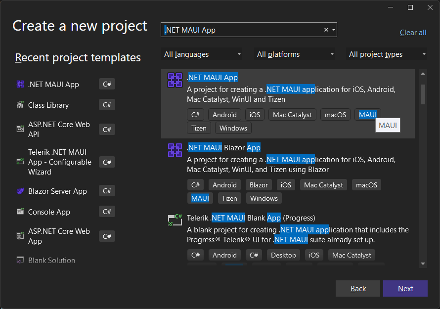
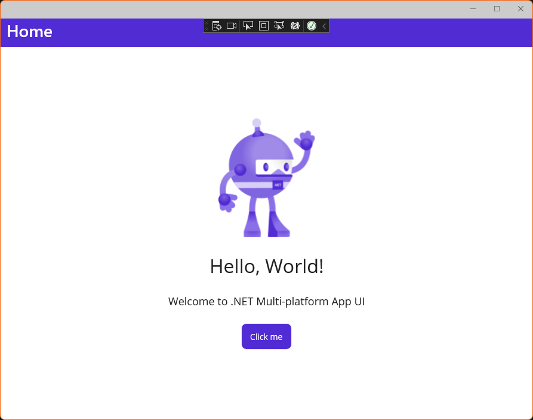

# Bindable Properties in MAUI

Bindable properties are an essential part of developing a robust user interface in MAUI. They allow you to create properties that can be bound to UI elements, enabling you to respond to user input and update the UI in real-time. With bindable properties, you can also perform validation on user input and display errors in the UI.

> :point_up: **Note**: This demo applies only to MAUI XAML projects. MAUI Blazor doesn't require property change notifications. Instead, it uses it's own binding system which relies on calling `StateHasChanged()` to re-render a component.

## Introduction

In this tutorial, we'll cover the creation and effective usage of bindable properties in your MAUI app. We'll start by tracing the evolution from `INotifyPropertyChanged` to `ObservableObject`, ultimately leading to `BindableProperty`.

By the end of this tutorial, you will have a better understanding of how to create and use bindable properties in MAUI to build robust and responsive user interfaces.

Here is a preview of what the final application will look like:


Let's dive in!

## Prerequisites

Before starting this tutorial, you should have some experience with C# and MAUI development. You should be familiar with creating and using controls and layouts in MAUI. If you're new to MAUI development, the [Official MAUI documentation](https://docs.microsoft.com/dotnet/maui/) is a great place to start. Additionally, if you have experience with Xamarin.Forms, it will be helpful in understanding some of the concepts in this tutorial.

To follow along with the demo in this tutorial, you will need:

- .NET 7 SDK or later
- Visual Studio 2022
- Basic knowledge of C# and XAML

If you don't have experience with Xamarin.Forms, don't worry, as we will be covering everything you need to know about Bindable Properties in MAUI. If you have these prerequisites covered, let's move on to building our demo application.

### .NET 7.0

Download the latest version of the .NET 7.0 SDK [here](https://dotnet.microsoft.com/en-us/download).

### Visual Studio 2022

To follow along with this demo, I will be using the latest version of Visual Studio 2022. You can download it [here](https://visualstudio.microsoft.com).

### Required Workloads

To build .NET MAUI applications, you will also need the .NET Multi-platform App UI development workload. If you haven't already installed it, you can do so by following these steps:

1. Open Visual Studio Installer and select "Modify" on your installation.
2. In the "Workloads" tab, select the ".NET Multi-platform App UI development" workload.
3. Click "Modify" to start the installation process.

  

Once the installation is complete, you're ready to start building your .NET MAUI application.

## Demo

In this tutorial, we'll be creating a MAUI application to showcase how to use bindable properties. We will start by using the old way of notifying the UI when a property changes, which is to implement `INotifyPropertyChanged`.

We will show how to use `ObservableObject` to reduce the boilerplate code of using `INotifyPropertyChanged`.

Then, we will move on to the new way of doing this, which is creating a bindable property using `BindableProperty.Create` and binding it to our UI.

Finally, we will look at how binding to an object, rather than implement bindable properties on a model, is the ideal solution for data-binding in MAUI.

### Create a .NET MAUI Application

Open Visual Studio 2022 and select "Create a new project".

  

Search for ".NET MAUI App" in the search bar and select it.

  

Set the name to **BindablePropertiesInMaui** and click **Next**.

  

In the "Additional information" window, choose the app's target Framework and click "Create" to create the project.

  

Great, now let's run the app to ensure everything is working as expected.

In this case, I will be demonstrating the app on a Windows Machine, but you can run it on your preferred emulator or simulator and expect similar results.

  

### Implementing INotifyPropertyChanged

Before we dive into bindable properties, let's take a step back and look at implementing `INotifyPropertyChanged`. This interface is used to notify the UI when a property changes so that it can be updated accordingly.

Let's define a `Person` class with three properties, `FirstName`, `LastName` and `DateOfBirth`. We will also implement the `INotifyPropertyChanged` interface and add a method called `OnPropertyChanged` that raises the `PropertyChanged` event when a property is changed. We use this method in the setters of our properties to notify the UI when a property has changed.

*Person.cs*:

```csharp
using System.ComponentModel;

namespace BindablePropertiesInMaui;

public class Person : INotifyPropertyChanged
{
    public Person(string firstName, string lastName, DateTime dateOfBirth)
    {
        _firstName = firstName;
        _lastName = lastName;
        _dateOfBirth = dateOfBirth;
    }

    private string _firstName;
    public string FirstName
    {
        get => _firstName;
        set
        {
            if (_firstName == value) return;
            _firstName = value;
            OnPropertyChanged(nameof(FirstName));
        }
    }

    private string _lastName;
    public string LastName
    {
        get => _lastName;
        set
        {
            if (_lastName == value) return;
            _lastName = value;
            OnPropertyChanged(nameof(LastName));
        }
    }

    private DateTime _dateOfBirth;
    public DateTime DateOfBirth
    {
        get => _dateOfBirth;
        set
        {
            if (_dateOfBirth == value) return;
            _dateOfBirth = value;
            OnPropertyChanged(nameof(DateOfBirth));
        }
    }

    public event PropertyChangedEventHandler PropertyChanged;

    protected virtual void OnPropertyChanged(string propertyName)
    {
        PropertyChanged?.Invoke(this, new PropertyChangedEventArgs(propertyName));
    }
}
```

#### Create a PersonComponent

Now let's create a new `PersonComponent` XAML file using the `ContentView` object to represent the UI for the person's information. This component will display the person's information in their respective controls (e.g. Entry for FirstName, Entry for LastName, and DatePicker for DateOfBirth). 

This component will be used to display the person's information on the main page of the app.

Right-click on the `BindablePropertiesInMaui` project and select Add -> New Item.
Select the ".NET MAUI" option on the left-hand side and then select ".NET MAUI ContentView (XAML)" on the right-hand side.v
Name the file *PersonComponent.xaml* and click the "Add" button.

  

Replace the default XAML code with the following code:

*PersonComponent.xaml*:

```xaml
<?xml version="1.0" encoding="utf-8" ?>
<ContentView xmlns="http://schemas.microsoft.com/dotnet/2021/maui"
			 xmlns:x="http://schemas.microsoft.com/winfx/2009/xaml"
			 x:Class="BindablePropertiesInMaui.PersonComponent">
	<StackLayout MaximumWidthRequest="400">
		<Label Text="Person"
			   FontSize="Medium"
			   Margin="0,24,0,0" />
		<Entry Text="{Binding FirstName}"
			   Placeholder="First Name"
			   Margin="0,24,0,0" />
		<Entry Text="{Binding LastName}"
			   Placeholder="Last Name"
			   Margin="0,24,0,0" />
		<DatePicker Date="{Binding DateOfBirth}"
					Margin="0,24,0,0"
					DateSelected="DatePicker_DateSelected" />
	</StackLayout>
</ContentView>
```

Open the *PersonComponent.xaml.cs* file and replace the default code with the following C# code:

*PersonComponent.xaml.cs*:

```csharp
namespace BindablePropertiesInMaui;

public partial class PersonComponent : ContentView
{
	private Person _person = new("Carl", "Franklin", DateTime.Now );

	public PersonComponent()
	{
		InitializeComponent();
		BindingContext = _person;
	}

	private void DatePicker_DateSelected(object sender, DateChangedEventArgs e)
	{
		_person.DateOfBirth = e.NewDate;
	}
}
```

Open the *MainPage.xaml* file and replace the default code with the following XAML code:

*MainPage.xaml*:

```xaml
<?xml version="1.0" encoding="utf-8" ?>
<ContentPage xmlns="http://schemas.microsoft.com/dotnet/2021/maui"
			 xmlns:x="http://schemas.microsoft.com/winfx/2009/xaml"
			 x:Class="BindablePropertiesInMaui.MainPage"
			 xmlns:local="clr-namespace:BindablePropertiesInMaui">
	<local:PersonComponent/>
</ContentPage>
```

Open the *MainPage.xaml.cs* file and replace the default code with the following C# code:

```csharp
namespace BindablePropertiesInMaui;

public partial class MainPage : ContentPage
{
	public MainPage()
	{
		InitializeComponent();
	}
}
```

After running the application, you will see that the controls are automatically populated with the data from the `Person` class' constructor `private Person _person = new("Carl", "Franklin", DateTime.Now );` in the *PersonComponent.xaml.cs* class.

  

Additionally, observe that modifying any of the fields in the user interface will update the corresponding properties

  

  

So far we have:

- Created a `Person` class that implements `INotifyPropertyChanged` with `FirstName`, `LastName`, and `BirthDate` properties.
- Created a `PersonComponent` `ContentView` control to represent a person and bind its properties to the person object.
- Replaced the default `MainPage.xaml` and `MainPage.xaml.cs` code to display the `PersonComponent` object in the UI.

### MVVM Toolkit

The MVVM Toolkit is a set of libraries for building modern, scalable, and easy-to-maintain applications using the Model-View-ViewModel (MVVM) pattern in WPF, WinUI, Xamarin, and MAUI. The toolkit provides a number of features that simplify the development process and make it easier to create maintainable and testable code. Some of the benefits of the MVVM Toolkit include:

- Simplified data binding: The toolkit provides a simplified syntax for data binding, which makes it easy to bind data between the view and the view model without having to write a lot of boilerplate code.

- Commanding: The toolkit provides a Command class that can be used to implement commands in the view model, which can be bound to controls in the view.

- ObservableObject: The toolkit provides an `ObservableObject` class that simplifies the implementation of the `INotifyPropertyChanged` interface, which is required for data binding. The `ObservableObject` class provides a `SetProperty` method that automatically raises the `PropertyChanged` event and updates the value of a property.

In the following demo, we will demonstrate the use of `ObservableObject` provided by the MVVM Toolkit. It is worth noting that we will focus solely on this topic as each benefit of the toolkit deserves a more in-depth discussion.

To learn more about the MVVM Toolkit go to [Introduction to the MVVM Toolkit](https://learn.microsoft.com/en-us/dotnet/communitytoolkit/mvvm/).

### Implement ObservableObject

Implementing `INotifyPropertyChanged` was the standard way of enabling data binding in .NET for years. However, it required developers to write a lot of repetitive code in each view model or model class to fire property changed events for every property. This led to code that was difficult to maintain and prone to errors.

Eventually, a solution was developed in the form of the `ObservableObject` class. This class simplifies the process of implementing `INotifyPropertyChanged` by handling the event firing for all properties automatically. Developers can simply inherit from this class and define their properties as usual without having to worry about the underlying event handling code.

To use the `ObservableObject` class, you need to install the `CommunityToolkit.Mvvm` NuGet package. You can do this by running the following command in the NuGet Package Console:

```powershell
install-package CommunityToolkit.Mvvm
```

After installing the package, you can use the `ObservableObject` class in your code to reduce the boilerplate code required for implementing the `INotifyPropertyChanged` interface.

Replace the *Person.cs* code with the following code:

*Person.cs*:

```csharp
using CommunityToolkit.Mvvm.ComponentModel;

namespace BindablePropertiesInMaui;

public class Person : ObservableObject
{
    public Person(string firstName, string lastName, DateTime dateOfBirth)
    {
        _firstName = firstName;
        _lastName = lastName;
        _dateOfBirth = dateOfBirth;
    }

    private string _firstName;
    public string FirstName
    {
        get => _firstName;
        set => SetProperty(ref _firstName, value);
    }

    private string _lastName;
    public string LastName
    {
        get => _lastName;
        set => SetProperty(ref _lastName, value);
    }

    private DateTime _dateOfBirth;
    public DateTime DateOfBirth
    {
        get => _dateOfBirth;
        set => SetProperty(ref _dateOfBirth, value);
    }
}
```

In this example, the `SetProperty` method is used to set the property value and fire the `PropertyChanged` event automatically. By using the `ObservableObject` class, developers can reduce the amount of boilerplate code in their projects and make their code more maintainable and error-free.

After running the application, it can be observed that the data binding functionality still works bidirectionally. Furthermore, it can be noted that the amount of repetitive code has been significantly reduced, providing a more concise and maintainable codebase.

  

Observe that modifying any of the fields in the user interface still will update the corresponding properties

  

To learn more about `ObservableObject`, visit the official Microsoft documentation at [ObservableObject](https://learn.microsoft.com/en-us/dotnet/communitytoolkit/mvvm/observableobject).

### Creating Bindable Properties

Having explored the previous approaches that led to the current solution using bindable properties, let's now shift our focus to creating bindable properties since we now understand how to implement `INotifyPropertyChanged`.

In this section, we will convert the code from using the old `INotifyPropertyChanged` to the new `BindableProperty`.

Open *Person.cs* file.

Remove the `INotifyPropertyChanged` interface and the `OnPropertyChanged` method since we won't need them with the new `BindableProperty`.

Replace each property with a `BindableProperty`. Add the following code for the `FirstName` property:

```csharp
public static readonly BindableProperty FirstNameProperty =
     BindableProperty.Create(nameof(FirstName), typeof(string), typeof(Person), string.Empty, BindingMode.TwoWay);

public string FirstName
{
     get => (string)GetValue(FirstNameProperty);
     set => SetValue(FirstNameProperty, value);
}
```

Repeat the step above for the `LastName` and `DateOfBirth` properties, replacing the existing code for each property with the following:

```csharp
public static readonly BindableProperty LastNameProperty =
     BindableProperty.Create(nameof(LastName), typeof(string), typeof(Person), string.Empty, BindingMode.TwoWay);

public string LastName
{
     get => (string)GetValue(LastNameProperty);
     set => SetValue(LastNameProperty, value);
}

public static readonly BindableProperty DateOfBirthProperty =
     BindableProperty.Create(nameof(DateOfBirth), typeof(DateTime), typeof(Person), DateTime.Now, BindingMode.TwoWay);

public DateTime DateOfBirth
{
     get => (DateTime)GetValue(DateOfBirthProperty);
     set => SetValue(DateOfBirthProperty, value);
}
```

Below is the updated *Person.cs* file with bindable properties for `FirstName`, `LastName`, and `DateOfBirth`:

*Person.cs*:

```csharp
namespace BindablePropertiesInMaui;

public class Person : BindableObject
{
    public static readonly BindableProperty FirstNameProperty = BindableProperty.Create(nameof(FirstName), typeof(string), typeof(Person), string.Empty);
    public static readonly BindableProperty LastNameProperty = BindableProperty.Create(nameof(LastName), typeof(string), typeof(Person), string.Empty);
    public static readonly BindableProperty DateOfBirthProperty = BindableProperty.Create(nameof(DateOfBirth), typeof(DateTime), typeof(Person), DateTime.Now);

    public Person(string firstName, string lastName, DateTime dateOfBirth)
    {
        FirstName = firstName;
        LastName = lastName;
        DateOfBirth = dateOfBirth;
    }

    public string FirstName
    {
        get => (string)GetValue(FirstNameProperty);
        set => SetValue(FirstNameProperty, value);
    }

    public string LastName
    {
        get => (string)GetValue(LastNameProperty);
        set => SetValue(LastNameProperty, value);
    }

    public DateTime DateOfBirth
    {
        get => (DateTime)GetValue(DateOfBirthProperty);
        set => SetValue(DateOfBirthProperty, value);
    }
}
```

Open the *PersonComponent.xaml* file.

Update the `Entry` controls to bind to the new `FirstName`, `LastName` and `DateOfBirth` bindable properties:

Here's the updated *PersonComponent.xaml* file:

```xaml
<?xml version="1.0" encoding="utf-8" ?>
<ContentView xmlns="http://schemas.microsoft.com/dotnet/2021/maui"
             xmlns:x="http://schemas.microsoft.com/winfx/2009/xaml"
             x:Class="BindablePropertiesInMaui.PersonComponent">
    <StackLayout MaximumWidthRequest="400">
        <Label Text="Person"
               FontSize="Medium"
               Margin="0,24,0,0" />
        <Entry Text="{Binding FirstName, Mode=TwoWay}"
               Placeholder="First Name"
               Margin="0,24,0,0" />
        <Entry Text="{Binding LastName, Mode=TwoWay}"
               Placeholder="Last Name"
               Margin="0,24,0,0" />
        <DatePicker Date="{Binding DateOfBirth, Mode=TwoWay}"
                    Margin="0,24,0,0" />
    </StackLayout>
</ContentView>
```

After running the application, it can be observed that the values hard-coded in `private Person _person = new("Carl", "Franklin", DateTime.Now);` of the `Person` class in the *PersonComponent.xaml.cs* are still binding to the UI.

  

Also notice that any UI changes also bind to the code behind.

  

  

Wondering which approach to use for data binding in your MAUI application, `INotifyPropertyChanged`, `ObservableObject`, or `BindableProperty`? Let's explore the reasons to choose one over the other.

`INotifyPropertyChanged`, `ObservableObject` and `BindableProperty` provide a mechanism for two-way data binding between UI elements and code-behind. However, `BindableProperty` is specifically designed for use with the latest .NET MAUI framework and provides some benefits over `INotifyPropertyChanged` and `ObservableObject`, such as better performance, type safety, and compatibility with Xamarin.Forms and .NET MAUI platforms.

Additionally, `BindableProperty` allows for better control over binding modes and default values, making it a more robust and convenient solution for modern app development.

On the other hand, even though bindable properties are less intrusive than using `ObservableObject` because bindable properties are defined within the class itself, while `ObservableObject` requires your models to inherit from a base class. This can be seen as a disadvantage because it limits the inheritance hierarchy of your classes.

In other words, if you want to use a base class other than `ObservableObject`, you would need to create a separate version of your model class, leading to code duplication and reduced maintainability.

Additionally, it may not always be desirable or practical to modify the inheritance hierarchy of your model classes to implement data binding.

So, how can we implement the ideal solution?

The answer is to remove any base class dependencies from our model, and instead create a ViewModel object that implements BindableProperties on the UI side, and accesses your clean model objects in any way you see fit.

### Binding to a ViewModel

To begin, let's clean up our *Person.cs* model by removing the `BindableObject` base class, resulting in a plain old CLR object (POCO). Replace the contents of *Person.cs* with the following code:

*Person.cs*:

```csharp
namespace BindablePropertiesInMaui;

public class Person
{
    public Person(string firstName, string lastName, DateTime dateOfBirth)
    {
        FirstName = firstName;
        LastName = lastName;
        DateOfBirth = dateOfBirth;
    }

    public string firstName;
    public string FirstName
    {
        get => firstName;
        set
        {
            firstName = value;
        }
    }

    public string _lastName;
    public string LastName
    {
        get => _lastName;
        set
        {
            _lastName = value;
        }
    }

    public DateTime _dateOfBirth;
    public DateTime DateOfBirth
    {
        get => _dateOfBirth;
        set
        {
            _dateOfBirth = value;
        }
    }
}
```

Create a new class called *PersonEditor.cs* (our ViewModel) and add the following code inside:

*PersonEditor.cs*:

```csharp
namespace BindablePropertiesInMaui;

public class PersonEditor : BindableObject
{
    public static readonly BindableProperty PersonProperty = BindableProperty.Create(
        nameof(Person),
        typeof(Person),
        typeof(PersonEditor));

    public PersonEditor(Person person)
    {
        Person = person;
    }

    public Person Person
    {
        get { return (Person)GetValue(PersonProperty); }
        set { SetValue(PersonProperty, value); }
    }
}
```

Note that the `PersonEditor` class extends the `BindableObject` class, unlike the `Person` class. This is because we want to use the properties as bindable properties, and we need to inherit from `BindableObject` in order to do so.

By separating the view model (`PersonEditor`) from the model (`Person`), we keep the concerns of our classes separate and maintain a clear separation of concerns in our code.

This is a good practice in software development, as it makes our code easier to maintain and modify in the future.

Then modify the *PersonComponent.xaml* file as shown below:

```xaml
<?xml version="1.0" encoding="utf-8" ?>
<ContentView xmlns="http://schemas.microsoft.com/dotnet/2021/maui"
			 xmlns:x="http://schemas.microsoft.com/winfx/2009/xaml"
			 x:Class="BindablePropertiesInMaui.PersonComponent">

	<StackLayout MaximumWidthRequest="400">
		<Label Text="Person"
			   FontSize="Medium"
			   Margin="0,24,0,0" />
		<Entry Text="{Binding Person.FirstName, Mode=TwoWay}"
			   Placeholder="First Name"
			   Margin="0,24,0,0" />
		<Entry Text="{Binding Person.LastName, Mode=TwoWay}"
			   Placeholder="Last Name"
			   Margin="0,24,0,0" />
		<DatePicker Date="{Binding Person.DateOfBirth, Mode=TwoWay}"
					Margin="0,24,0,0" />
	</StackLayout>
</ContentView>
```

Lastly, update the *PersonComponent.xaml.cs* file with the code below:

```csharp
namespace BindablePropertiesInMaui;

public partial class PersonComponent : ContentView
{
    private PersonEditor personEditor;

    // This person obhect would typically come from a db or another store
    readonly Person person = new("Carl", "Franklin", DateTime.Now);

    public PersonComponent()
    {
        InitializeComponent();
        personEditor = new PersonEditor(person);
        BindingContext = personEditor;
    }

    private void DatePicker_DateSelected(object sender, DateChangedEventArgs e)
    {
        personEditor.Person.DateOfBirth = e.NewDate;
    }
}
```

After making these changes, run the application once again and observe that the fields are still properly bound to the UI:

  

Our model still gets updated despite not extending the `ObservableObject` class, as we have effectively implemented data binding through the use of bindable properties on an object.

  

## Summary

In this tutorial, we've learned about bindable properties in MAUI and how to create them. We started by implementing `INotifyPropertyChanged` to notify the UI when a property changes.

We showed how to use `ObservableObject` to reduce the boilerplate code of using `INotifyPropertyChanged`.

Then, we created a bindable property using `BindableProperty.Create` and saw how to bind to it in our UI.

Finally, we looked at how binding to an object, rather than implement bindable properties on a model, is the ideal solution for data-binding in MAUI.

For more detailed information on how to develop .NET MAUI applications, check out the links to documentation and tutorials in the resources section below.

## Complete Code

The complete code for this demo, including implementation of `INotifyPropertyChanged` and `BindableProperty` with validation, can be found in the link below. You can use it as a reference to implement bindable properties in your own .NET MAUI applications.

- <https://github.com/carlfranklin/BindablePropertiesInMaui>

## Resources

Here are some helpful resources for learning more about .NET MAUI and bindable properties in MAUI:

| Resource                                 | Url                                                                               |
| ---------------------------------------- | --------------------------------------------------------------------------------- |
| The .NET Show with Carl Franklin         | <https://www.youtube.com/playlist?list=PL8h4jt35t1wgW_PqzZ9USrHvvnk8JMQy_>        |
| Download .NET                            | <https://dotnet.microsoft.com/en-us/download>                                     |
| .NET Multi-platform App UI documentation | <https://docs.microsoft.com/dotnet/maui/>                                         |
| MVVM Toolkit                             | <https://learn.microsoft.com/en-us/dotnet/communitytoolkit/mvvm/>                 |
| MVVM Toolkit - ObservableObject          | <https://learn.microsoft.com/en-us/dotnet/communitytoolkit/mvvm/observableobject> |
